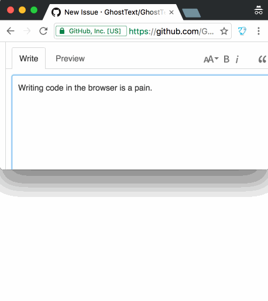

# 
Use your text editor to write in your browser. Everything you type in the editor will be instantly updated in the browser (and vice versa).

## Installation

0. Install the editor extension: [for Sublime Text](https://sublime.wbond.net/packages/GhostText) or [for Atom](https://github.com/GhostText/GhostText-for-Atom)
1. Install the browser extension: [for Chrome](https://chrome.google.com/webstore/detail/sublimetextarea/godiecgffnchndlihlpaajjcplehddca) or [for Firefox](https://addons.mozilla.org/firefox/addon/ghosttext-for-firefox/)

## Website support 

* `<textarea>` elements
* [`contentEditable`](https://developer.mozilla.org/en-US/docs/Web/Guide/HTML/Content_Editable) areas: like in Gmail
* [CodeMirror](http://codemirror.net/) editors: used on CodePen, JSFiddle, JS Bin, …
* [Ace](http://ace.c9.io/) editor: used on Tumblr, …

## Usage

### Open the connection

In Chrome, click the GhostText button in the upper-right corner to open up Sublime Text. Alternatively you can you these keyboard shortcuts to activate GhostText:

<table>
  <tr>
    <th>OS</th>
    <th>Shortcut</th>
  </tr>
  <tr>
    <td>Windows</td>
    <td><kbd>ctrl</kbd> + <kbd>shift</kbd> + <kbd>K</kbd></td>
  </tr>
  <tr>
    <td>Linux</td>
    <td><kbd>ctrl</kbd> + <kbd>shift</kbd> + <kbd>H</kbd></td>
  </tr>
  <tr>
    <td>Mac</td>
    <td><kbd>cmd</kbd> + <kbd>shift</kbd> + <kbd>K</kbd></td>
  </tr>
  <tr>
    <td colspan="2">The shortcut can be <a href="http://lifehacker.com/add-custom-keyboard-shortcuts-to-chrome-extensions-for-1595322121">changed or disabled</a></td>
  </tr>
</table>

If there is more than one supported field in the current page and you haven't *focused* any of them already, you will be prompted to click on a field to open the connection.

### Close the connection

The connection will be closed when:
* The webpage changes or is reloaded
* The tab or window is closed (either in the browser or in the editor)
* The used field is removed from the document

## Complementary repos

* [GhostText for SublimeText](https://github.com/GhostText/GhostText-for-SublimeText)
* [GhostText for Atom](https://github.com/GhostText/GhostText-for-Atom) (prototype)
* [GhostText for Vim](https://github.com/falstro/ghost-text-vim) (fan-built prototype)

## Learn more

* [Video of how it works](http://www.youtube.com/watch?v=e0aLFPtYPZI&feature=share)
* [Article about the initial proof of concept](http://cacodaemon.de/index.php?id=59)
